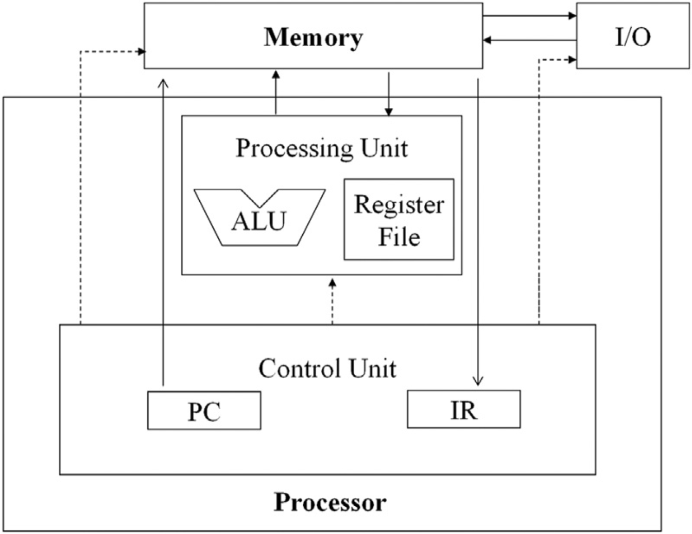
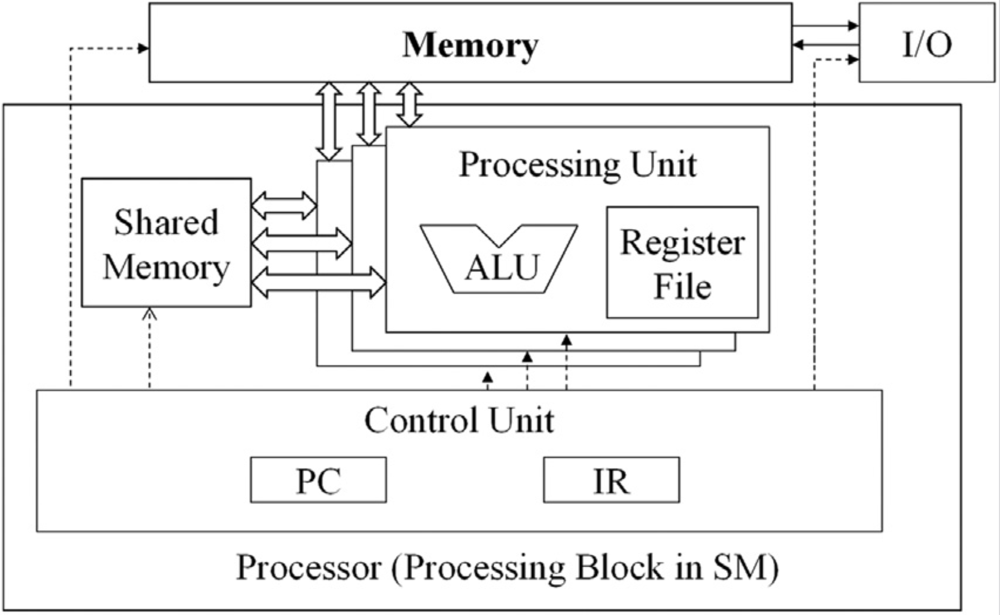
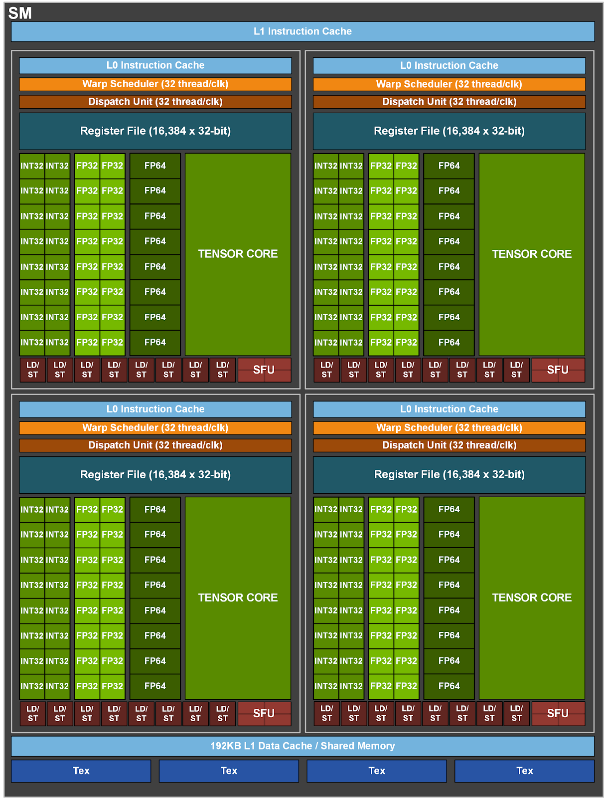
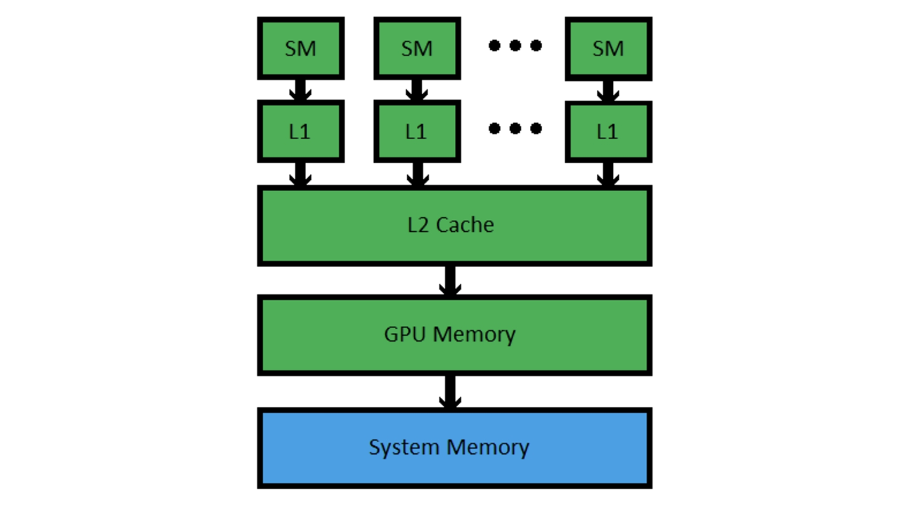

# CUDA 编程入门（1）：英伟达GPU的硬件架构简介

CUDA 是建立在英伟达GPU硬件架构之上的并行计算平台和编程模型。因此，就像要写好高性能的 CPU 程序，必须对 CPU 的硬件架构有一定的理解一样，我们写 CUDA 程序也必须对 GPU 有最基本的了解。

## 从冯诺依曼体系结构说起

总所周知，冯诺依曼体系结构是现代计算机的基础，它包含了五个基本部件：运算器、控制器、存储器、输入设备和输出设备。其中，运算器和控制器合称为中央处理器（CPU），存储器包括内存和外存，输入设备和输出设备合称为外设。CPU 通过总线与内存和外设进行数据交换。

* 图1.1 冯诺依曼体系结构[1]

经过近几十年的高速发展，这些基本部件都变得无比复杂且强大。对于 CPU 来说，它的核心频率已达到数 GHz，核心数量也达到数十甚至上百个。而存储器则发展出了多层次的体系结构，包括一级缓存、二级缓存、三级缓存、内存、硬盘等。

但即便拥有这无与伦比速度的现代 CPU + 内存体系，人们仍然在不断尝试新的方法冲刺计算性能上限。随着摩尔定律逐渐失效，提高 CPU 频率变得越来越困难，因此提高处理器的核心数量就成了一种收效更好的方法。

通过提升处理器核心数量来提升计算性能这种思路促进了并行计算理论以及应用技术的发展，从而诞生了 GPGPU 这一概念。从体系结构上来看，GPU 技术扩展了冯诺依曼结构中的运算单元，将其从单个变成了多个

* 图1.2 GPU 改进的冯诺依曼体系结构[1]

也就是说，一个控制单元对应多个运算单元，这样一来，每条指令可以同时运行在多个运算单元上，这种模式也被称为 SIMT（Single Instruction Multiple Thread，单指令多线程），SIMT 是 GPU 实现 SIMD (Single Instruction Multiple Data, 单指令多数据) 的方式。

需要注意的是，GPU 的这种创新与 CPU 的多核心不是一个层次的概念，多核 CPU 的每个物理核心仍然是单线程的（虽然CPU有超线程技术，但只是逻辑上的双核心）。另一方面，虽然 CPU 也能实现 SIMD，但 CPU 的实现方式是增加寄存器宽度，然后使用扩展指令（SSE，AVX等）执行运算，从而达到向量化计算的效果。由于寄存器数量有限，因此 CPU 核心的并行能力相对于 GPU 来说是非常有限的。

## 流式多处理器 (Streaming Multiprocessor, SM)

流式多处理器可以看作是 GPU 的处理核心，同 CPU 的多核设计类似，GPU 也有多个流式多处理器（通常远超 CPU 的核心数量），比如 GA100 有 128 个 SM，GV100 有 84 个 SM。深入到 SM 内部来看，它又被划分成多个处理块（Processing Block），这里所谓的**处理块**就是我们前面提到的单指令多线程单元，它的控制单元包含指令缓存（Instruction Cache）、线程束调度器（Warp Scheduler）、分配单元（Dispatch Unit）等组件，而运算单元则包含一大堆各种类型的处理核心，官方术语叫流处理器（Stream Processor, SP），这些 SP 被分为多个组，有的负责 INT 运算，有的负责 FP16 运算，以及 FP32，FP64 等等，从软件层面来看，他们又被称为 CUDA Core。值得一提的是，从 Volta 架构开始，英伟达引入了一种新的 SP，叫做 Tensor Core，专门用于加速矩阵运算。

* 图1.3 GA100 的 SM 结构图[2]

## 内存层次结构
 
英伟达 GPU 的存储硬件设备主要由寄存器文件，L1 缓存，L2 缓存和 GPU 显存组成，其中 L1 缓存位于 SM 内部，L2 缓存由所有 SM 共享。L1 和 L2 缓存都是片上内存，因此相较于 GPU 显存来说，拥有更高的读写速度。

* 图1.4 GPU 的内存层次结构简化图[3]

## 显存带宽 (Memory Bandwidth)

显存带宽是 GPU 的一项重要性能指标，它反映了 SM 在计算的过程中从显存中读写数据的速度，单位是 (GB/s)。显然，由于在 SM 中还存在运算指令执行过程，所以实际的程序利用的有效带宽并不能完全达到显存带宽提供的理论上限。了解显存带宽的指导意义在于，可以帮助我们评估算法的硬件利用率，如果利用率太低，那么就需要考虑如何优化算法，从而提高性能。

与显存相关的指标还有位宽（bus width），内存频率（clock rate）等，它们与带宽的关系[4]如下：

$$
BandWidth = 2 \times MemClockRate \times (BusWidth / 8)
$$

以 A100 40G GPU 为例，它的显存位宽为 5120 bit，频率为 1215 MHz，那么它的显存带宽就是

$$
BandWidth = 2 \times (1215MHz \times 10^{-3} GHz/MHz)  \times (5120 bit / (8bit/Byte)) = 1555 GB/s
$$

## 算力 (Performance)

GPU 的算力是指其在单位时间内能够完成的浮点运算次数，常用单位有 FLOPS，GFLOPS，TFLOPS，分别表示 float operation per second，giga float operation per second，tera float operation per second。

由于 GPU 的计算核心被分成了多个数据类型，且每个数据类型的核心数量可能不同，所以 GPU 针对不同数据类型的算力也有可能是不同的。总的来说，GPU 的理论峰值算力计算公式为

$$
PeakPerf = 2 \times CUDACores \times BoostClockRate
$$

其中 $CUDACores$ 是特定数据类型的 CUDA 核心数量，$BoostClockRate$ 表示 GPU 的 Boost 频率。之所以这里还乘以 2，是因为每个 CUDA 核心在每个时钟周期可以执行一次 FMA 操作，而每个 FMA 操作包含一次乘法和一次加法，因此每个 CUDA 核心每个时钟周期可以执行两次浮点运算。

以 A100 为例，它每个 SM 的 FP32 CUDA 核心数量为 64，总的 SM 数量为 108，Boost 频率为 1410 MHz，那么它的理论 FP32 峰值算力就是

$$
PeakPerf_{fp32} = 2 \times 64 \times 108 \times 1.410GHz = 19.5 TFLOPS
$$

这与官方公布的文档[5]中的数据是一致的。

## 参考

[1] 这两张图来源于 PMPP 这本书 4.4 节关于 SIMD 硬件的讨论。

[2] [NVIDIA Ampere Architecture In-Depth](https://developer.nvidia.com/blog/nvidia-ampere-architecture-in-depth/)

[3] [CUDA Memory and Cache Architecture](http://supercomputingblog.com/cuda/cuda-memory-and-cache-architecture/)

[4] [How to Implement Performance Metrics in CUDA C/C++](https://developer.nvidia.com/blog/how-implement-performance-metrics-cuda-cc/)

[5] [NVIDIA A100 Tensor Core GPU Architecture](https://images.nvidia.com/aem-dam/en-zz/Solutions/data-center/nvidia-ampere-architecture-whitepaper.pdf)

* https://www.nvidia.cn/content/dam/en-zz/zh_cn/Solutions/Data-Center/volta-gpu-architecture/Volta-Architecture-Whitepaper-v1.1-CN.compressed.pdf

