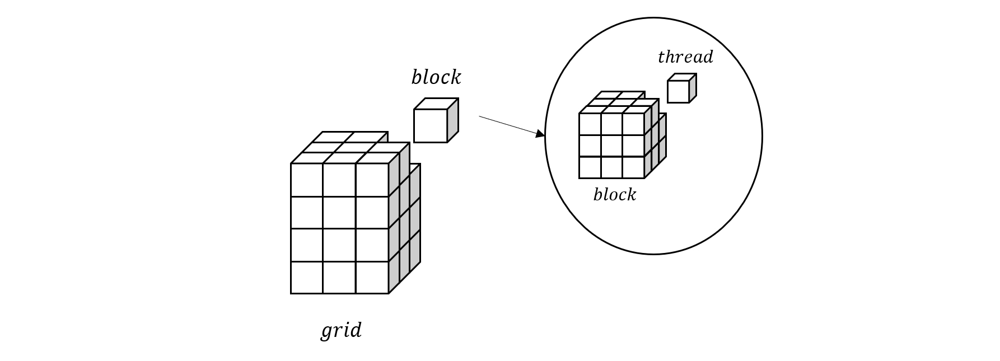

# CUDA 编程入门（2）：CUDA 编程模型

CUDA 的全称是 Compute Unified Device Architecture，它是建立在英伟达 GPU 硬件架构之上的并行计算平台和编程模型。

## CUDA 计算模型

CUDA 计算模型是对 GPU 运算单元的抽象，它是一种分层次的计算结构，其中最基本的计算单位是**线程** (Thread)，从逻辑上来讲，每个 thread 可以负责计算任务的一部分，比如向量相加任务中的元素相加、矩阵乘法任务中的行列相乘等等。于是，通过 thread，我们可以将一个大的计算任务分解成多个小的计算任务，以更加细粒度的方式来调度，从而实现高效的并行计算。

Thread 的物理执行单元就是流处理器(SP)，也就是说，每个 thread 都会被分配到一个 SP 执行，具体的调度过程是用户不可见的，由 CUDA 来完成。比 thread 更高一层的计算结构是**块**(block)，由多个 thread 组成，它被分配到流式多处理器(SM)。

这里我们可以看到，物理设备 SP 和 SM 的关系刚好就对应到 thread 和 block，每个 SM 包含多个 SP，每个 block 也包含多个 thread。由于不同硬件架构的 GPU，每个 SM 中的 SP 数量是不一样的，如果直接基于硬件进行编程，则需要开发者在开发过程中考虑到不同硬件情况下的资源分配问题，这显然不是一项简单的工作。而经过 CUDA 这层抽象，开发者只需要申请 thread 即可，具体的调度则交给 CUDA，极大的简化了并行程序的开发难度。

在 block 之上，还有一层**网格**(grid)，它由多个 block 组成。通过 thread，block 和 grid 这三层抽象，用户可以根据实际的需求来组织并行计算任务，从而高效地实现相关算法。

最后还需要提及的是在 thread 和 block 之间，有一个被称为**线程束** (warp) 的重要概念。每个 warp 由 32 个 thread 组成，它是 CUDA 中的最小调度单位，也就是说，每个 warp 中的 32 个 thread 会被同时调度到一个 SM 中的 32 个 SP 上执行，这种调度方式也被称为 SIMT (Single Instruction Multiple Thread)。

上图比较形象的展示了 grid，block 和 thread 的关系，其中 grid 和 block 都是具有三个维度的结构，通过坐标可以定位到具体的 block 和 thread。

## CUDA 内存模型

从硬件层面来看，GPU的存储设备主要有寄存器文件，L1 缓存，L2 缓存和 HBM。而 CUDA 则把这些物理硬件抽象成了多种不同功能的逻辑内存。主要包括

- 寄存器 (register)
- 本地内存 (local memory)
- 共享内存 (shared memory)
- 全局内存 (global memory)
- 常量内存 (constant memory)

其中，register 和 local memory 是 thread 私有的，shared memory 由 block 内的所有 thread 共享，global memory 和 constant memory 则是 grid 内全局可见。

register 实际就位于 SM 的 register file，因此具有最高的读写速度，shared memory 位于 SM 的片上内存，速度也相当快。而 global memory 则是 HBM 的软件抽象，相对于片上内存，具有较高的读写延迟。剩下的 local memory 和 constant memory 则是存储在 global memory 中，因此 local memory 和 global memory 的访问速度大致相当，但常量值一般会被缓存起来，所以 constant memory 的读取速度相对更快。

## CUDA 调度模型

## 参考
