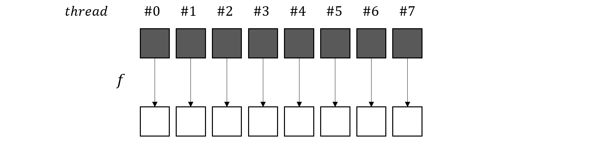
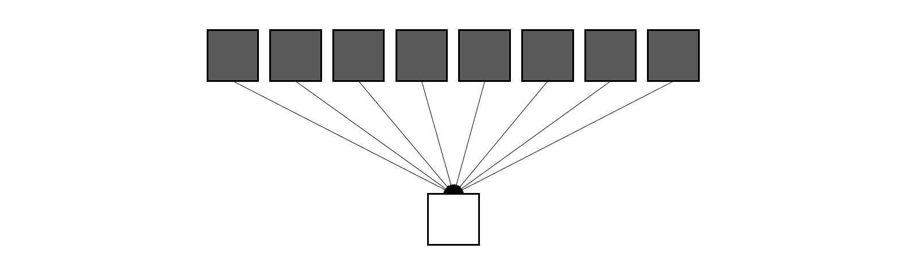
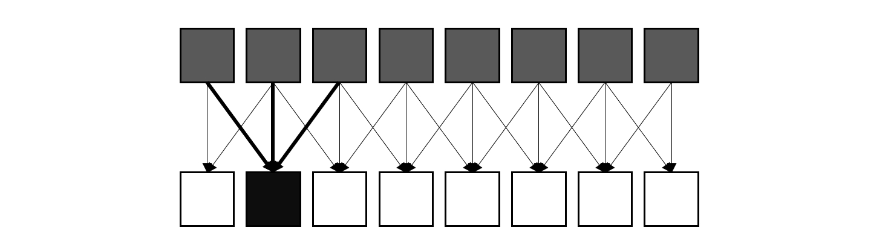

# CUDA 编程入门（5）：数据并行原语

所谓的数据并行原语是一系列最基础的并行计算模式，通过对这些并行原语的合理组合，我们可以构建更加复杂的并行算法，本篇文章我们将对这些并行模式进行简单介绍。

## Map 操作

Map 操作就是让多个处理核心对输入的每个元素应用同一个函数，从而得到一个新的数组。在串行程序中，主要是通过循环遍历数组来实现，时间复杂度为 $\mathcal{O}(n)$ ，而在并行场景下，每个处理单元（thread）负责计算一个元素，因此理论上可以达到 $\mathcal{O}(1)$ 的时间复杂度。Map 操作的应用十分广泛，比如在张量运算中，张量加或乘一个标量，就可以看作是一个 Map 操作。

## Reduce 操作

Reduce 操作是将一组数据通过某种运算缩减成一个值，比如对数组求和，求均值等。在这种情况下，多个处理单元需要协同工作，因此如何组织数据的访问和同步是一个值得深入研究的问题。

## Gather 操作

Gather 操作有点向 Map 和 Reduce 的结合，它与 Map 的相似点是输出元素数量相同，与 Reduce 的相似点是每个输出元素都是由多个输入元素计算得到的。图中加粗的箭头就是元素的计算关系

典型的卷积运算就可以使用 Gather 操作来进行并行处理。

## Scatter 操作

## Scan 操作

## 参考

* [Intro to Parallel Programming CUDA](https://www.youtube.com/playlist?list=PLnH7E0IG44jFfiQBd_Ov7FmYHq8SZx6r0)