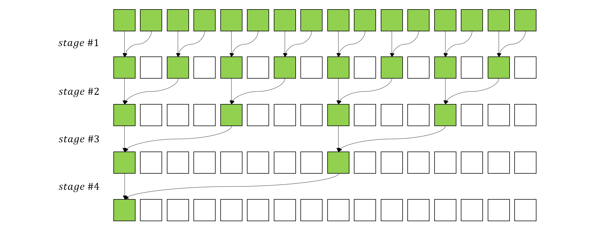

# CUDA 编程入门（7）：并行 Reduce

以数组求和为例，在序列式算法下，元素需要一个一个地被加起来，如果有 `N` 个元素，就需要 `N` 次加法。而在多核心条件下，我们需要结合 CUDA 的特性来设计算法以达成最佳的性能表现。

## 基础实现版本

首先考虑在无限多核心情况下，我们应该怎样组织计算资源。显然，与 Map 操作不同，Reduce 无法在 $\mathcal{O}(1)$ 的时间复杂度下完成操作，假设变量 `s` 为最终我们需要求得的数组和，如果采用多核心同时向 `s` 加上一个元素，那么得到的结果一定是不正确的。而为了得到正确的结果，我们需要对每次加法操作进行同步，也就是说，让每个计算核心争夺 `s` 的锁，完成运算之后再释放锁，这样一来，每个核心都能得到正确的结果，但是这种方式的时间复杂度就变成了 $\mathcal{O}(N)$，与序列式算法相同。

为了避免每次加法都需要同步，我们可以采用一种树形结构的规约模式，如下图所示



上图中的每个 stage，绿色的方框是参与运算的元素，可以看到，每个 stage 中，每个核心负责对相邻的两个元素求和，此时不需要任何同步，因为这里不需要一个全局的变量来存储求和结果。而每个 stage 之间需要同步操作，以确保当前 stage 的所有核心完成计算才进入下一个 stage，最终所有元素都被归约到了第一个元素位置上，这个元素就是我们需要的求和结果。

现在回到 CUDA 中来，此时每个 thread 就是一个计算核心，我们可以将数组中的元素分配到 thread 上进行计算。考虑到每个 block 上的 thread 数量是有限的，因此对于较大型的数组我们还需要声明多个 block。于是，使用 CUDA 来进行并行 Reduce 的思路就是：1. 在每个 block 内部进行规约，2. 对所有 block 的规约结果再次规约。根据以上描述，我们给出步骤 1 的 kernel 方法代码如下

```cpp
template <typename T, int blockSize>
__global__ void reduce_kernel_1(const T* data, const size_t n, T* result) {

    int tid = threadIdx.x;
    int globalId = threadIdx.x + blockIdx.x * blockDim.x;
    if(globalId >= n) return;

    __shared__ T sdata[blockSize];
    sdata[tid] = data[globalId];
    __syncthreads();

    for (int s = 1; s < blockDim.x; s *= 2) {
        if (tid % (2 * s) == 0) {
            sdata[tid] += sdata[tid + s];
        }
        __syncthreads();
    }

    if (tid == 0) {
        result[blockIdx.x] = sdata[0];
    }
}
```

我们对以上代码进行逐行解释：

1. 参数 `data` 是输入数组，`n` 是数组大小，`result` 是输出结果，它的大小为 `blockSize`，其中的每个元素会存储一个 block 的规约结果。
2. 首先获得当前 thread 在 block 中的索引 `tid`，以及当前需要处理元素在 `data` 中的全局索引 `globalId`。如果 `globalId` 超过了数组大小，则直接返回。
3. 在共享内存中声明一个大小为 `blockSize` 的数组 `sdata`，并将当前 thread 负责的元素拷贝到共享内存中，再应用 `__syncthreads()` 来确保所有 thread 都完成拷贝。
4. 开始 stage 循环，以 `s` 作为循环变量，在每个 stage 中，只有能被 `2 * s` 整除的 thread 才会参与计算，比如，当 `s = 1` 时，只有 `tid = 0, 2, 4, 6, ...` 的 thread 参与计算，当 `s = 2` 时，只有 `tid = 0, 4, 8, 12, ...` 的 thread 参与计算，以此类推。参与计算的两个元素位置为 `tid` 和 `tid + s`，计算结果被赋予 `tid` 所在位置。在两次 stage 之间，需要调用 `__syncthreads()` 同步方法确保当前 stage 的所有元素完成计算。由于每个 stage 之后，`s` 都会翻倍，因此总的 stage 数量为 $\log_2(blockSize)$。
5. 所有 stage 完成后，最终规约结果被保存在了 `sdata[0]`，因此只需要 thread 0 将其拷贝到 `result` 中即可。

## 控制发散（Control Divergence）优化


<!-- 下面我们给出 host 端代码

```cpp
template <typename T>
T reduce(T* data, 
         size_t n, 
         int type, 
         int numBlocks, 
         int numThreads) {
    T* d_data;
    T* d_result;
    T* result;

    cudaMalloc((void**)&d_data, sizeof(T) * n);
    cudaMalloc((void**)&d_result, sizeof(T) * numBlocks);
    result = (T*)malloc(sizeof(T) * numBlocks);

    cudaMemcpy(d_data, data, sizeof(T) * n, cudaMemcpyHostToDevice);

    cudaEvent_t start, stop;
    cudaEventCreate(&start);
    cudaEventCreate(&stop);

    cudaEventRecord(start);

    // call kernel function

    cudaDeviceSynchronize();
    cudaEventRecord(stop);

    cudaMemcpy(result, d_result, sizeof(T) * numBlocks, cudaMemcpyDeviceToHost);
    T sum = 0;
    for(int i = 0; i < numBlocks; i++) {
        sum += result[i];
    }

    return sum;
}    
```

在以上的代码中，Reduce 的第一步我们选择调用 kernel 方法解决，也就是使用 cuda 来进行并行规约，而第二步则为了简单起见直接在 host 端使用循环来完成。
 -->
