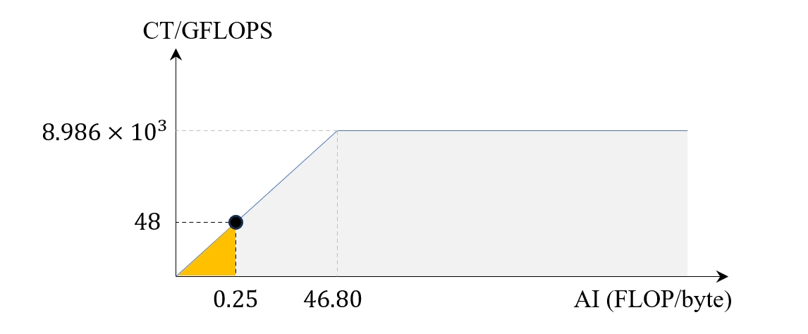
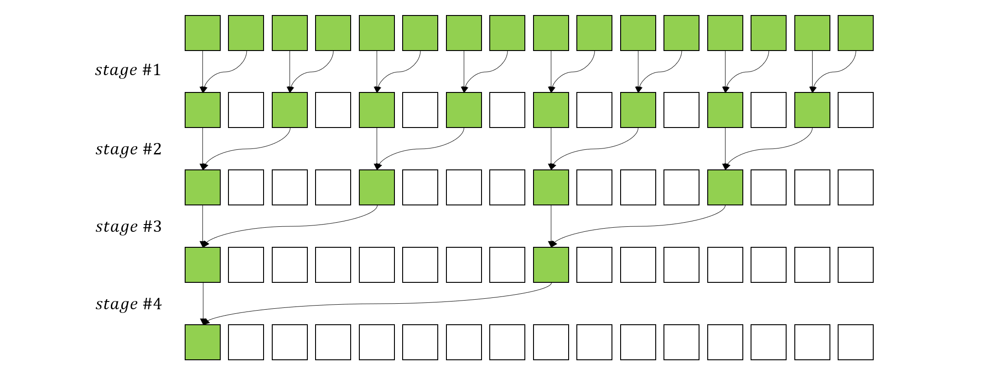
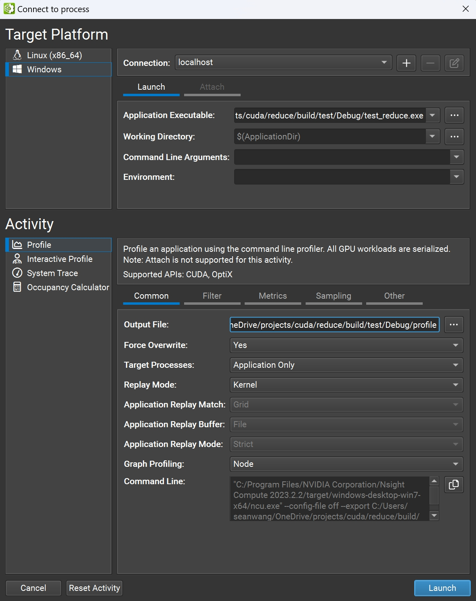
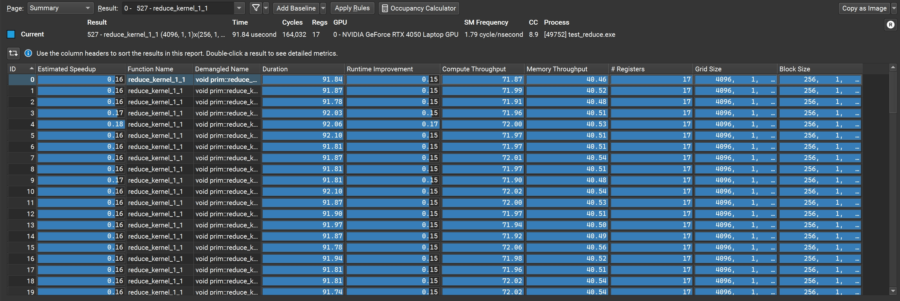
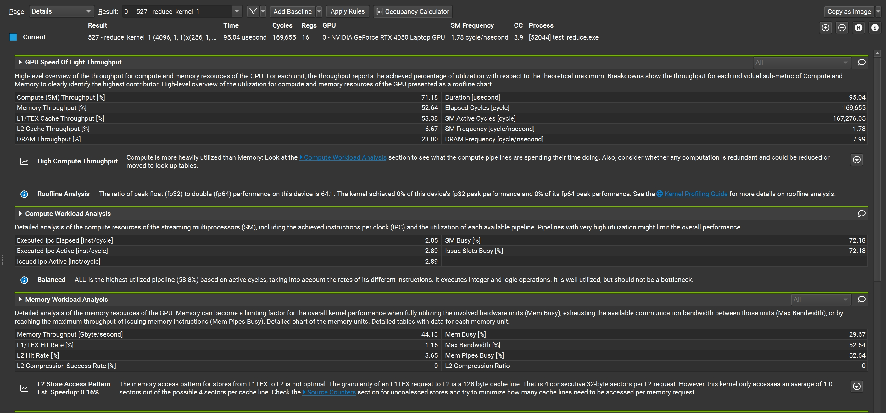
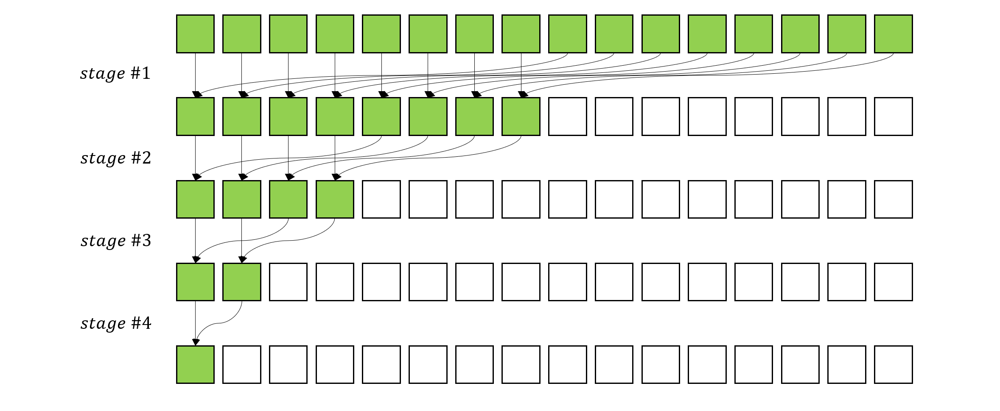
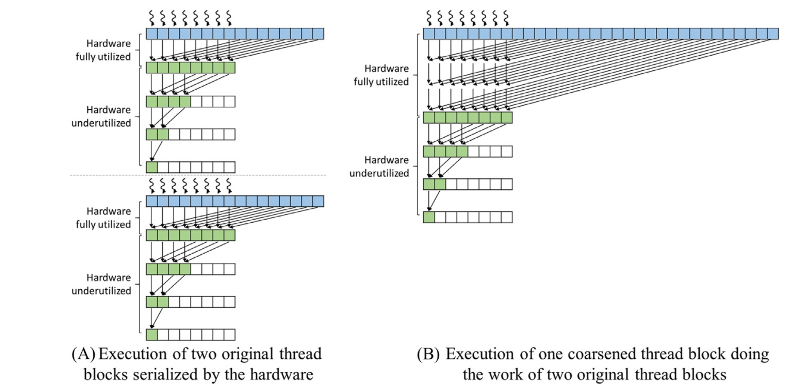

# CUDA 编程入门（7）：并行 Reduction 及其 kernel 优化技术

> 本文受 Mark Harris 的 Reduction PPT[0] 启发编写

CUDA 编程涉及到许多概念，包括 GPU 硬件相关的，CUDA 编程模型相关的，以及并行计算理论相关的，如果能够对这些概念有充分的理解并加以应用，那么就有可能写出更高性能的 CUDA 程序。本文以经典的 Reduction 算子——数组求和——为例，逐步介绍一些常见的 kernel 优化技术，并展示这些技术是如何提升 CUDA 程序的性能的。

## Roofline 模型分析

在正式编写代码实现某个算法之前，我们可以先分析该算法在指定硬件上的 Roofline 模型，从而对该算法的极限性能有个大致的预期。对于单精度数组求和这个任务来说，假设其元素数量等于 `n`，则运算量为 `n-1` 次加法，内存读取比特数为 `4n`，因此算术强度大约为 0.25。这里我以 RTX 4050 Mobile 笔记本作为测试平台进行分析，首先可以查到它的峰值 FP32 算力为 8.986 TFLOPS，显存带宽为 192 GB/s[1]，因此可以绘制出它的 Roofline 模型如下
 

图 0. Reduce 算子在 RTX 4050 上的 Roofline 模型

这里的 46.80 来自于 $8986 / 192$。其中黑点标明的位置就是 Reduction 操作在当前 GPU 上的性能峰值，也就是 100% 利用显存带宽的情况下能够达到的运算吞吐量，大约为 48 GFLOPS。

## 原子操作

假设我们要计算 `N` 个元素的和，最直接的想法是声明一个全局变量，让每个 thread 从数组中取一个元素加到这个变量上，最终得到求和结果。当然，为了避免数据竞争问题，我们使用 CUDA 提供的 `atomicAdd` 方法，确保每次运算都是原子操作。具体实现如下

```cpp
template <typename T>
__global__ void reduce_kernel_0(const T* data, const size_t n, T* result) {

    int tid = threadIdx.x + blockIdx.x * blockDim.x;
    if(tid >= n) return;

    atomicAdd(&result[0], data[tid]);
}
```

atomicAdd 虽然避免了数据竞争问题，但是每次计算相当于对全局变量加锁，理论上的时间复杂度和串行方法相同，因此效率不高[2]。

## 树形规约模式

为了充分利用 GPU 的多核心优势，可以采用分块计算的思路，即在逻辑上把数据分为两个块，分别计算每个块的和，最后在求总和。而在每个块内部，采用同样的思路递归的分块，最终可以得到如下的一个计算图[3]


图1：树形规约模式

上图中的每个 stage，绿色的方框是参与运算的元素，可以看到，每个 stage 中，每个核心负责对相邻的两个元素求和，此时不需要任何同步，因为这里不需要一个全局的变量来存储求和结果。而每个 stage 之间需要同步操作，以确保当前 stage 的所有核心完成计算才进入下一个 stage，最终所有元素都被归约到了第一个元素位置上，这个元素就是我们需要的求和结果。

现在回到 CUDA 中来，此时每个 thread 就是一个计算核心，我们可以将数组中的元素分配到 thread 上进行计算。考虑到每个 block 上的 thread 数量是有限的，因此对于较大型的数组我们还需要声明多个 block。于是，使用 CUDA 来进行并行 Reduction 的思路就是：1. 在每个 block 内部进行规约，2. 对所有 block 的规约结果求和。根据以上描述，可以给出 kernel 代码如下

```cpp
template <typename T, int blockSize>
__global__ void reduce_kernel_1(const T* data, const size_t n, T* result) {

    __shared__ T sdata[blockSize];

    int tid = threadIdx.x;
    int globalId = threadIdx.x + blockIdx.x * blockDim.x;
    sdata[tid] = globalId >= n ? 0 : data[globalId];

    __syncthreads();

    for (int s = 1; s < blockSize; s *= 2) {
        if (tid % (2 * s) == 0) {
            sdata[tid] += sdata[tid + s];
        }
        __syncthreads();
    }

    if (tid == 0) {
        atomicAdd(&result[0], sdata[0]);
    }
}
```

我们对这段代码进行逐行解释：

1. 参数 `data` 是输入数组，`n` 是数组大小，`result` 是存储最终求和结果的地方。
2. 在共享内存中声明一个大小为 `blockSize` 的数组 `sdata`。
3. 获得当前 thread 在 block 中的索引 `tid`，以及当前需要处理元素在 `data` 中的全局索引 `globalId`。再将数据从全局内存载入共享内存，如果 `globalId` 超过了数组大小，则将对应位置的元素设置为 0。
4. 使用 `__syncthreads()` 方法同步当前 block 中的所有 thread，直到所有数据拷贝完成。
5. 开始 stage 循环，以 `s` 作为循环变量，在每个 stage 中，只有能被 `2 * s` 整除的 thread 才会参与计算，比如，当 `s = 1` 时，只有 `tid = 0, 2, 4, 6, ...` 的 thread 参与计算，当 `s = 2` 时，只有 `tid = 0, 4, 8, 12, ...` 的 thread 参与计算，以此类推。参与计算的两个元素位置为 `tid` 和 `tid + s`，计算结果被赋予 `tid` 所在位置。在两次 stage 之间，需要调用 `__syncthreads()` 同步方法确保当前 stage 的所有元素完成计算。由于每个 stage 之后，`s` 都会翻倍，因此总的 stage 数量为 $\log_2(blockSize)$。
5. 所有 stage 完成后，最终规约结果被保存在了 `sdata[0]`，因此只需要 thread #0 将 `sdata[0]` 的数据加到 result 的第一个位置即可，这里使用 `atomicAdd` 确保多个 block 不会发生冲突。

这段 kernel 是跑在 GPU 上的，每个 thread 都会运行一遍，并且有大量 thread 是同时运行的。而在 Host 端的代码如下

```cpp
#define BLOCK_SIZE 256

template <typename T>
T reduce(T* data, 
         size_t n, 
         int type, 
         int numBlocks) {
    T* d_data;
    T* d_result;
    T result[1] = {0};

    cudaMalloc((void**)&d_data, sizeof(T) * n);
    cudaMalloc((void**)&d_result, sizeof(T) * numBlocks);

    cudaMemcpy(d_data, data, sizeof(T) * n, cudaMemcpyHostToDevice);

    cudaEvent_t start, stop;
    cudaEventCreate(&start);
    cudaEventCreate(&stop);

    cudaEventRecord(start);
    int repeat = 100;
    for (int i = 0; i < repeat; i++) {
        cudaMemcpy(d_result, result, sizeof(T) * 1, cudaMemcpyHostToDevice);
        switch(type) {
            case 1:
                reduce_kernel_1<T, BLOCK_SIZE><<<numBlocks, BLOCK_SIZE>>>(d_data, n, d_result);
                break;
            default:
                std::cout << "Invalid type: " << type << std::endl;
                exit(1);
        }
    }
    cudaEventRecord(stop);
    cudaEventSynchronize(stop);

    float milliseconds = 0;
    cudaEventElapsedTime(&milliseconds, start, stop);
    std::cout << "Total time: " << milliseconds << "ms" << std::endl;

    size_t bytes = sizeof(T) * n * repeat;
    float seconds = milliseconds / 1000;
    float throughput = bytes / seconds / 1000 / 1000 / 1000;
    std::cout << "Throughput: " << throughput << "GB/s" << std::endl;

    size_t flops = n * repeat;
    float gflops = flops / seconds / 1000 / 1000 / 1000;
    std::cout << "Performance: " << gflops << "GFLOPS" << std::endl;

    cudaMemcpy(result, d_result, sizeof(T) * 1, cudaMemcpyDeviceToHost);
    return result[0];
}    
```

这段代码首先将 Host 端的数据拷贝到 Device 内存上，然后在调用 kernel 前后设置了计时功能，为了排除 kernel 运行的偶然性，我们将其运行了 100 次，然后输出内存吞吐量和计算吞吐量，并返回结果以便验证计算正确性。需要注意的是，我们用 `type` 参数来控制运行的 kernel 版本，从而方便测量不同 kernel 实现的性能差异。

最后，我们列出当 `n = 1<<24` 时当前 kernel 的性能作为 baseline，以便后续优化的参考

|version| Total time (ms)| Throughtput (GB/s)| Performance (GFLOPS)|Speedup|
|:-----:|:----------:|:----------:|:----------:|:----------:|
|reduce_kernel_1|124.30|53.99|13.50|1|

## Nsight Compute 性能分析设置[4]

Nsight Compute 是 Nvidia 官方发布的 GPU 程序性能测试软件，使用该软件可以方便地对我们写的 CUDA 程序进行性能分析，并提供优化建议。在对我们的程序编译出可执行文件后，再以管理员权限打开 Nsight Compute，选择菜单栏的 connection -> connect，可以看到下图所示的窗口


图2： Nsight Compute Connection 窗口

这里我们设置好可执行文件路径以及输出文件路径后，点击 Launch 即可启动 profile。NC 会为每次 kernel 运行生成一份报告


图3： Nsight Compute 报告 summary

注意左上角的 page 下拉框，目前我们在 summary 标签下，列出了所有 kernel 执行结果的汇总信息，包括 kernel 执行时间、吞吐量、性能等。一般情况下，NC 测量的性能会比我们在代码里计算的稍微低一点，这是因为 NC 在 profile 过程中会对 kernel 方法造成一定的性能损耗，所以 NC 给出的性能参考只应该作为我们优化的依据，而不是程序本身能达到的最高性能。

双击进入我们感兴趣的 kernel 报告后可以看到非常详细的指标信息，并且还提供了部分指标的优化建议，点击右上角的 + 符号，还可以展开更详细的图表信息，这部分内容有点繁杂，我们会在后面的内容中逐步涉及。


图4： Nsight Compute 报告 detail

如果要对比两份报告，可以点击上面的 `Add Baseline` 按钮将其中一份设置为 baseline，这样，查看第二份报告时，将会显示出它与 baseline 的指标差异信息。

## 优化共享内存读取次数[5]

在基础版本的 reduce kernel 方法中，观察执行加法的这行代码

```cpp
sdata[tid] += sdata[tid + s];
```

可以发现，每次都需要从共享内存中读取两次，写入一次，但实际上 `sdata[tid]` 这个值完全可以保留在当前线程的寄存器中，仅需要读 `sdata[tid+s]`，因此，我们可以将 stage 的循环代码修改为

```cpp
    T sum = sdata[tid];
    for (int s = 1; s < blockDim.x; s *= 2) {
        if (tid % (2 * s) == 0) {
            sdata[tid] = sum = sum + sdata[tid + s];
        }
        __syncthreads();
    }
```

经过修改后的性能指标如下

|version| Total time (ms)| Throughtput (GB/s)| Performance (GFLOPS)|Speedup|
|:-----:|:----------:|:----------:|:----------:|:----------:|
|reduce_kernel_1|127.29|52.72|13.18|1|
|reduce_kernel_2|123.18|54.48|13.62|1.03|

这里我们看到了些许提升，通过 Nsight Compute 分析后，查看 Memory Workloads Analysis section 对比修改前后的 Share Memory 表格（需要展开 section）可以发现 shared_load 指令减少了 40% 以上。


图5： Nsight Compute 共享内存访问统计

## Control Divergence 优化[6]

我们知道，在 CUDA 中的最小调度单位为 warp，其中每个 warp 由连续 32 个 thread 组成。在上面的基础实现中，我们使用 `if` 语句来控制 thread 的执行流程，导致同一个 warp 某些 thread 执行不同的代码分支。而这会导致 warp 调度器分两个 pass 来处理，第一个 pass 执行 `if` 分支，第二个 pass 执行 `else` 分支。这种情况被称为 Control Divergence，它会降低 warp 的执行效率，在实际编程中应该尽量避免。


图6： Control Divergence 示意图


观察前面的树形规约的示意图可以得到规律：

s = 1 时，thread `#k` 处理元素 `sdata[2k]` 和 `sdata[2k+1]`；<br>
s = 2 时，thread `#k` 处理元素 `sdata[4k]` 和 `sdata[4k+2]`；<br>
s = 4 时，thread `#k` 处理元素 `sdata[8k]` 和 `sdata[8k+4]`；<br>
...

因此可以将 stage 循环修改成如下代码

```cpp
    T sum = sdata[tid];
    for (int s = 1; s < blockSize; s *= 2) {
        int idx = 2 * s * tid;
        if(idx < blockSize) {
            sdata[idx] = sum = sum + sdata[idx + s]; 
        }
        __syncthreads();
    }
```

虽然这里仍然使用了 `if` 语句，但它只会在 `blockSize` 无法整除 32 时才会影响最后一个 warp。因此，上述代码避免了 Control Divergence，会比基础实现版本有更好执行效率。

|version| duration (ms)| Throughtput (GB/s)| Performance (GFLOPS)|Speedup|
|:-----:|:----------:|:----------:|:----------:|:----------:|
|reduce_kernel_1|127.29|52.72|13.18|1|
|reduce_kernel_2|123.18|54.48|13.62|1.03|
|reduce_kernel_3|77.65|86.43|21.61|1.64|

## Bank Conflicts 优化

首先我们解释一下 Bank Conflicts 是什么。先从内存说起，简单来讲，内存就是存储数据的设备，可以把它看作一个网格，每个格子可以存储一个单位的数据，比如一个 int 类型的数字。当然，每个格子有自己的唯一地址，通过地址，处理器可以向其读取或者写入数据。


当然这只是一个极其简化的模型，实际上内存的结构还是很复杂的，但这并不是重点。GPU 中所谓的共享内存是一种在 block 的所有 threads 之间共享的内存，由于它的硬件位置就在 SM 上，所以读写速度相当快，仅次于寄存器。不仅如此，共享内存还支持并发读写，这一特性的实现要归功于它独特的组织方式。如下图所示


共享内存在结构上被划分为 32 个 bank，每个 bank 占据了一列。在这种结构组织方式下，共享内存有如下的读取规则：

**在同一个 warp 上**
1. 不同的 thread 可以同时读取不同 bank 上的数据；
2. 不同的 thread 可以读取同一个 bank 上相同位置的数据，底层原理是一个 thread 读取数据后再广播到其他 thread；
3. 不同的 thread 不能同时读取同一个 bank 上不同位置的数据，这种情况下，读取操作会被串行化。

其中规则 3 就被称为 bank conflicts，是一种需要被避免的模式。

现在我们来看下上面的代码是如何导致 bank conflicts 的，假设 block 上的 thread `#0` 读取了共享内存中 bank `#0` 和 `#1`，按照连续读取的规律，则 thread `#16` 读取的应该是第二行的 bank `#0` 和 `#1`。由于每个 warp 由 32 个 thread 组成，因此前 16 个 thread 和后 16 个 thread 会读到相同的 bank，导致串行化。如下图所示


这个问题的解决办法其实也很简单，只需要在每个 stage 让每个 thread 读取的 bank 编号相同即可。比如说，假设 `sdata` 的大小为 256，在第一个 stage，令 thread `#k` 读取 bank `#k` 和 `#k + 127`，其中 `0<=k<128`，显然 `#k` 和 `#k+127` 位于同一个 bank，不存在 bank conficts。这种方式修改了每个 thread 读取的元素位置，但不会改变最终结果，它将树形规约形式变成了下面这样



对应的代码修改为

```cpp
for (int s = blockSize / 2; s >= 1; s >>= 1) {
    if(tid < s) {
        sdata[tid] += sdata[tid + s];
    }
    __syncthreads();
}
```

经过修改后的性能指标如下

|version| duration (ms)| Throughtput (GB/s)| Performance (GFLOPS)|Speedup|
|:-----:|:----------:|:----------:|:----------:|:----------:|
|reduce_kernel_1|127.29|52.72|13.18|1|
|reduce_kernel_2|123.18|54.48|13.62|1.03|
|reduce_kernel_3|77.65|86.43|21.61|1.64|
|reduce_kernel_4|60.37|111.16|27.79|2.11|

从 NC 的 Shared Memory 表格也可以看出来，bank conflicts 减少了 99% 以上。


## 循环展开（Loop Unrolling）优化

循环展开是一种被广泛应用的指令级优化技术，循环本身是一种非常有用的控制结构，但在某些情况下，它会带来一些额外开销，比如循环条件判断，循环变量更新操作等。循环展开就是把循环过程显式的写出来，比如上述的 stage 循环，根据当前的 GPU Compute Capability，每个 block 上的 thread 数量最多为 1024 个，因此 stage 循环的最大次数为 10 次，我们可以将其展开

```cpp
    T sum = sdata[tid];
    if(blockSize >= 1024) {
        if(tid < 512) {
            sdata[tid] = sum = sum + sdata[tid + 512];
        }
        __syncthreads();
    }
    
    if(blockSize >= 512) {
        if(tid < 256) {
            sdata[tid] = sum = sum + sdata[tid + 256];
        }
        __syncthreads();
    }

    if(blockSize >= 256) {
        if(tid < 128) {
            sdata[tid] = sum = sum + sdata[tid + 128];
        }
        __syncthreads();
    }

    if(blockSize >= 128) {
        if(tid < 64) {
            sdata[tid] = sum = sum + sdata[tid + 64];
        }
        __syncthreads();
    }

    if(blockSize >= 64) {
        if(tid < 32) {
            sdata[tid] = sum = sum + sdata[tid + 32];
        }
        __syncthreads();
    }

    if(blockSize >= 32) {
        if(tid < 16) {
            sdata[tid] = sum = sum + sdata[tid + 16];
        }
        __syncthreads();
    }

    if(blockSize >= 16) {
        if(tid < 8) {
            sdata[tid] = sum = sum + sdata[tid + 8];
        }
        __syncthreads();
    }

    if(blockSize >= 8) {
        if(tid < 4) {
            sdata[tid] = sum = sum + sdata[tid + 4];
        }
        __syncthreads();
    }

    if(blockSize >= 4) {
        if(tid < 2) {
            sdata[tid] = sum = sum + sdata[tid + 2];
        }
        __syncthreads();
    }

    if(blockSize >= 2) {
        if(tid < 1) {
            sdata[tid] = sum = sum + sdata[tid + 1];
        }
        __syncthreads();
    }
```

这里的每个 stage，我们都会判断 `blockSize` 的大小，是为了避免当实际设置的 `blockSize` 小于某个值的情况下造成数组越界的问题。由于 `blockSize` 是模板参数，在编译时就已经确定了，判断语句会在编译时被优化掉，不会影响运行时的性能。

值得一提的是，循环展开并不需要像上面那样手动的编写重复代码，C++ 本身有语法扩展 `#pragma unroll` 帮助我们自动实现循环展开，就像下面这样

```cpp
    T sum = sdata[tid];
    #pragma unroll
    for (int s = blockSize / 2; s >= 1; s >>= 1) {
        if(tid < s) {
            sdata[tid] = sum = sum + sdata[tid + s];
        }
        __syncthreads();
    }
```

只要求循环边界在编译时已知（也就是这里的 blockSize）就可以让编译器帮我们展开循环。下面我们再给出本次优化的性能对比[7]

|version| duration (ms)| Throughtput (GB/s)| Performance (GFLOPS)|Speedup|
|:-----:|:----------:|:----------:|:----------:|:----------:|
|reduce_kernel_1|127.29|52.72|13.18|1|
|reduce_kernel_2|123.18|54.48|13.62|1.03|
|reduce_kernel_3|77.65|86.43|21.61|1.64|
|reduce_kernel_4|60.37|111.16|27.79|2.11|
|reduce_kernel_5|59.90|112.03|28.01|2.13|

## 优化最后一个 Warp

虽然编译器能够优化外层的 `blockSize` 判断语句，但是第二层的 `tid` 判断语句仍然存在，可以发现，在最后一个 warp 中（也就是 tid < 32 之后的语句），每个 if 条件判断都会造成 Control Divergence 问题，而且其中的 `__syncthreads()` 也是多余的，因为根据 SIMT 调度方法，同一个 warp 里的所有线程在同一时刻执行相同的指令，因此不用额外制造屏障。针对这两个问题，官方给出的方法是将最后一个 warp 的规约封装成函数，去掉 if 判断和同步语句，如下所示

```cpp
template <typename T, unsigned int blockSize>
__device__ void warpReduce(volatile T* sdata, int tid) {
    if(blockSize >= 64) sdata[tid] += sdata[tid + 32];
    if(blockSize >= 32) sdata[tid] += sdata[tid + 16];
    if(blockSize >= 16) sdata[tid] += sdata[tid + 8];
    if(blockSize >= 8) sdata[tid] += sdata[tid + 4];
    if(blockSize >= 4) sdata[tid] += sdata[tid + 2];
    if(blockSize >= 2) sdata[tid] += sdata[tid + 1];
}
```

这里需要说明的是参数 `sdata` 被 `violatile` 关键字修饰，因此编译器不会对其进行优化，保证每次读写都是通过共享内存，而不是将其缓存到各自线程的寄存器，否则的话，前一个 stage 的结果没有被写回共享内存，后一个 stage 就会读取到旧值，造成运算错误。下面是优化结果

|version| duration (ms)| Throughtput (GB/s)| Performance (GFLOPS)|Speedup|
|:-----:|:----------:|:----------:|:----------:|:----------:|
|reduce_kernel_1|127.29|52.72|13.18|1|
|reduce_kernel_2|123.18|54.48|13.62|1.03|
|reduce_kernel_3|77.65|86.43|21.61|1.64|
|reduce_kernel_4|60.37|111.16|27.79|2.11|
|reduce_kernel_5|59.90|112.03|28.01|2.13|
|reduce_kernel_6|47.31|141.84|35.46|2.69|

## Warp Shuffling 优化

Warp 内线程间通信的需求相当广泛，比如上面的 `warpReduce` 使用 `violatile` 关键字实际上就是利用共享内存作为线程通信的媒介。但是频繁读写共享内存也会造成一定的性能损失，为此，CUDA 提供了 warp shuffling 机制，提供相关指令让 warp 内的线程可以通过寄存器直接交换数据。

Warp shuffling API 是以 `__shfl` 前缀开头的一系列指令，包括：`__shfl`，`__shfl_up`，`__shfl_down`，`__shfl_xor`，`__shfl_sync`，`__shfl_up_sync`，`__shfl_down_sync`，`__shfl_xor_sync`，其中以 `_sync` 结尾的指令是对应指令的同步版本，自 CUDA 9.0 版本后，不带 `_sync` 后缀的指令就被 deprecate 了，不推荐使用。

这里我们用到的 warp shuffling 指令是 `__shfl_down_sync`，所以重点介绍一下，其他更详细的文档请参考 [CUDA Programming Guide](https://docs.nvidia.com/cuda/cuda-c-programming-guide/index.html#warp-shuffle-functions)。`__shfl_down_sync` 的声明如下

```cpp
T __shfl_down_sync(unsigned mask, T var, unsigned int delta, int width=warpSize);
```

其中

* `mask` 是一个 32 位整数，它的每一位 1/0 表示对应位置的线程是否参与到本次运算，比如 `0xffffffff` 表示所有线程都参与运算，`0x0000ffff` 表示最后 16 个线程不参与。

* `var` 表示需要从目标线程获取的数据变量名称。

* `delta` 表示目标线程的偏移量，由当前线程 `id` 加上 `delta` 得到目标线程 `id`。需要注意的是如果目标线程被 `mask` 屏蔽掉了，那么将返回未定义值。

比如以下语句

```cpp
int a = ...
a += __shfl_down_sync(0xffffffff, a, 4);
```

表示当前 warp 内的每个线程都会将自己的 `a` 值加上它后面第 4 个线程的 `a` 值。下图比较直观地展示了 `__shfl_down_sync` 指令的效果


了解了 `__shfl_down_sync` 指令的作用后，我们就可以将 stage 循环的最后一个 warp 的规约代码修改为

```cpp
template <typename T, unsigned int blockSize>
__device__ void warpShuffleSum(T &sum) {
    unsigned int FULL_MASK = 0xffffffff;
    if(blockSize >= 32) {
        sum += __shfl_down_sync(FULL_MASK, sum, 16);    
    }
    if(blockSize >= 16) {
        sum += __shfl_down_sync(FULL_MASK, sum, 8);
    }
    if(blockSize >= 8) {
        sum += __shfl_down_sync(FULL_MASK, sum, 4);
    }
    if(blockSize >= 4) {
        sum += __shfl_down_sync(FULL_MASK, sum, 2);
    }
    if(blockSize >= 2) {
        sum += __shfl_down_sync(FULL_MASK, sum, 1);
    }
}
```

需要注意，warp shuffling 只能作用到同一个 warp 内的线程，所以我们得把 `if(blockSize >= 64) sdata[tid] += sdata[tid + 32];` 这一句移到方法调用外面，也就是说

```cpp
...
if(blockSize >= 64) {
    if(tid < 32) {
        sdata[tid] += sdata[tid + 32];
    }
    __syncthreads();
}

if (tid == 0) {
    T sum = sdata[0];
    warpShuffleSum<T, blockSize>(sum);
    result[blockIdx.x] = sum;
}
```

优化后的结果如下

|version| duration (ms)| Throughtput (GB/s)| Performance (GFLOPS)|Speedup|
|:-----:|:----------:|:----------:|:----------:|:----------:|
|reduce_kernel_1|127.29|52.72|13.18|1|
|reduce_kernel_2|123.18|54.48|13.62|1.03|
|reduce_kernel_3|77.65|86.43|21.61|1.64|
|reduce_kernel_4|60.37|111.16|27.79|2.11|
|reduce_kernel_5|59.90|112.03|28.01|2.13|
|reduce_kernel_6|47.31|141.84|35.46|2.69|
|reduce_kernel_7|46.10|145.56|36.39|2.76|


## Thread Coarsening 优化

在以上的所有版本实现中，我们给每个元素都分配了一个 thread，但实际上，仅在从全局内存中读取数据的时候，这些线程才算是全部都用上了。对于每个 block 来说，在第一个 stage，仅有一半的 thread 参与计算，下一个 stage 活跃的 thread 再少一半，以此类推，直到最后剩余一个活跃 thread。根据 block 的调度规则，虽然在 stage 循环的过程中，活跃 thread 成倍减少，但它们所占用的资源却始终被保留，直到 block 任务完成才被释放。

而另一方面，每个 block 可以分配的 thread 是有限的，当计算规模比较大的时候，给每个元素都分配一个 thread 意味着需要申请大量的 block。但由于 SM 可以同时分配的 block 数量也有限，多余的 block 则会暂时挂起。所以我们会看到，一边是正在执行的 block 中活跃 thread 越来越少，但资源却没释放，一边是大量被挂起的 block 申请不到资源，这种资源错配也是导致性能损失的重要原因。

解决这个问题的方法就是 thread coarsening，也就是说让每个 thread 负责处理多个元素。具体来说就是让每个 thread 读取多个元素，然后对这些元素求和，接下来再执行正常的树形规约操作。虽然每个 thread 的求和过程是串行的，但是相对于被浪费来说，这是更好的选择。下面我们借用 PMPP 这本书中关于 thread coarsening 的示意图[]来说明这个过程



图中左半部分展示了因为资源限制，导致 block 的并行度受限的简化情况，相对于右半部分让每个 thread 处理多个元素，左边的时间花费更多。

接下来我们从编程的角度分析如何实现上述过程，由于 SM 能够同时处理的 block 数量有限，所以我们可以考虑显式的设置 block 数量。在 `blockSize` 一定的情况下，就可以知晓每个 thread 负责的元素数量。


上图展示了这种新的处理模式，图中橙色的条带表示位于 global 内存中的数据，白色的条带表示 grid，它被多个 block 分隔，红色的点表示 block 中的 thread，黑色的点表示 thread 读取的元素，每个 thread 读取多个元素并在求和之后写入共享内存。具体实现代码如下

```cpp
    __shared__ T sdata[blockSize];

    int gridSize = blockSize * gridDim.x;
    int tid = threadIdx.x;
    int globalId = tid + blockIdx.x * blockSize;

    sdata[tid] = 0;

    T sum = sdata[tid];

    while(globalId < n) {
        sum += data[globalId];
        globalId += gridSize;
    }

    sdata[tid] = sum;

    __syncthreads();
```

|version| duration (ms)| Throughtput (GB/s)| Performance (GFLOPS)|Speedup|
|:-----:|:----------:|:----------:|:----------:|:----------:|
|reduce_kernel_1|127.29|52.72|13.18|1|
|reduce_kernel_2|123.18|54.48|13.62|1.03|
|reduce_kernel_3|77.65|86.43|21.61|1.64|
|reduce_kernel_4|60.37|111.16|27.79|2.11|
|reduce_kernel_5|59.90|112.03|28.01|2.13|
|reduce_kernel_6|47.31|141.84|35.46|2.69|
|reduce_kernel_7|46.10|145.56|36.39|2.76|
|reduce_kernel_8|37.09|180.92|45.23|3.43|

可以看到，经过 thread coarsening 优化之后性能有较大幅度的提升，其中内存吞吐量达到了带宽的 `180.92/192 = 94.23%`，运算吞吐量也接近 roofline 模型给出的 48GFLOPS 极限值。

## 总结

我们在这篇文章中，借用对 Reduce 并行算法的优化过程，展示了 CUDA 编程中常见的性能热点和优化技术概念，包括 Control Divergence，Bank Conflicts，Warp Shuffling，Thread Coarsening 等。通过对这些技术的合理应用，能够大幅提升 CUDA 程序的性能。最后，我们在[gitlab]()上给出所有源码，感兴趣的同学可以参考。

## 参考

[0] [Optimizing Parallel Reduction in CUDA](https://developer.download.nvidia.com/assets/cuda/files/reduction.pdf).

[1] [NVIDIA GeForce RTX 4050 Mobile](https://www.techpowerup.com/gpu-specs/geforce-rtx-4050-mobile.c3953).

[2] CUDA仍在不断发展，atmoic 系列方法在不同的硬件架构和数据类型上的表现也有所不同，根据我的实验，在 Ampere 架构上，使用 atomicAdd 对整型数组求和速度相当快，但是对浮点型仍然很慢。

[3] 任何并行算法都可以被构造成一个有向无环图，图中同一层的节点可以并行计算，相互连接的节点之间存在依赖关系，需要先后计算，因此理论算法时间步等于计算图的深度，相关内容可以查看 [https://stanford.edu/~rezab/dao/notes/lecture01/cme323_lec1.pdf](https://stanford.edu/~rezab/dao/notes/lecture01/cme323_lec1.pdf).

[4] 关于 Nsight Compute 的更多内容可以参考官方文档 [Kernel Profiling Guide](https://docs.nvidia.com/nsight-compute/ProfilingGuide/index.html).

[5] 这里的思路来自于官方 cuda-samples 示例中的 [reduction 项目](https://github.com/NVIDIA/cuda-samples/blob/master/Samples/2_Concepts_and_Techniques/reduction/reduction_kernel.cu#L196).

[6] Control Divergence 在 PMPP 这本书的 4.5 节有详细的讨论。

[7] 在我实际的实验中，手动展开循环的性能反而会有所下降，这可能与编译器对循环的编译优化有关系。 